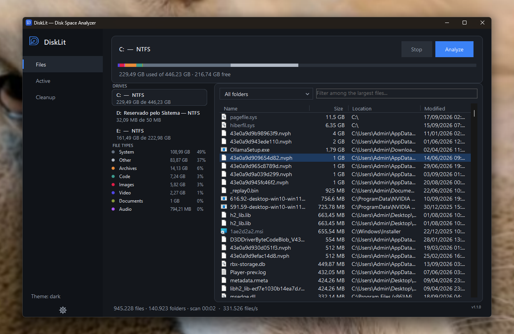
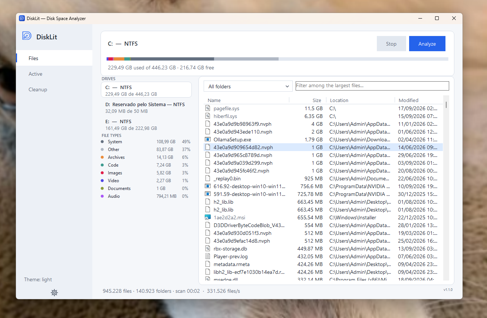

# DiskLit

**Find out what is filling your disk. Read-only, no administrator rights, open source.**

[](LICENSE)
[](https://github.com/romolocraft/DiskLit/releases/latest)
[](https://github.com/romolocraft/DiskLit/releases)




### [⬇ Download DiskLit for Windows](https://github.com/romolocraft/DiskLit/releases/latest/download/DiskLit-win-x64.exe)

One file. No installer. No runtime to set up. Requires 64-bit Windows 10 or 11.

---

## Why another disk analyzer

DiskLit does not try to be the fastest tool available. It tries to be the one you can run
immediately, on any machine, without handing it administrator rights, and whose source you can read
in an afternoon.

| | DiskLit | MFT-based analyzers (WizTree and similar) | Explorer folder properties |
|---|---|---|---|
| Administrator rights | **Not required** | Required — reading the raw MFT needs elevation | Not required |
| Speed on a large volume | Seconds | Fastest available | Minutes |
| Source code | **Open, MIT** | Varies by product | Closed |
| Explains Windows system files | **Yes** | No | No |
| Network access | **None** | Varies | None |
| Deletes anything on its own | **No** | No | No |

**Be clear about the trade-off:** tools that parse the NTFS Master File Table directly are
genuinely faster than DiskLit, and if raw speed with elevation is what you need, use one of those.
DiskLit walks the filesystem with `FindFirstFileEx`, which costs some speed and buys you a scan
that never asks for administrator rights.

In practice it is still quick. On a 446 GB NTFS SSD, a warm scan of **945,228 files across 140,923
folders finished in about 2 seconds**. The first scan after a reboot is slower, because the
filesystem cache is cold.

## What it does

**Files.** Finds the largest files on any drive and shows where they live, with a folder breakdown,
a per-type size legend, and a filter that narrows the list to a single folder.

Windows system files are flagged and explained instead of merely listed. Select `hiberfil.sys` and
DiskLit tells you it mirrors your RAM for hibernation, that Fast Startup uses it too, and that the
way to reclaim the space is `powercfg /h off` — not deleting the file. The same applies to
`pagefile.sys`, `swapfile.sys`, crash dumps, `Windows.old`, `WinSxS`, `System Volume Information`
and the installer cache. These are exactly the entries that dominate a "what is eating my disk"
list and exactly the ones a user should not remove by hand.

**Active.** A live process list with CPU, memory, executable path and an origin column that marks
processes served from protected Windows directories. Backed by a single `NtQuerySystemInformation`
call rather than one performance counter per process. It is read-only — DiskLit never ends a
process — and it stops sampling entirely when the tab is not visible.

**Cleanup.** A basic, fast sweep of well-known temporary locations: user and Windows temp, the
Windows Update download cache, thumbnail cache, crash dumps, Delivery Optimization and browser
caches. It is not a deep clean and it never touches personal files.

Every location expands so you can pick individual files, everything is listed with its size and
full path before anything happens, nothing runs without an explicit confirmation, and deletions go
to the **Recycle Bin** so they can be undone.

**Appearance.** Follows the Windows light/dark setting and reacts to theme changes while running.
Available in English, Portuguese, Spanish and Russian. Language, theme and search engine are saved
to a plain text file in `%APPDATA%\DiskLit\settings.txt`.

**Removable drives.** Plugging in or ejecting a drive updates the list on its own — DiskLit listens
for `WM_DEVICECHANGE` and refreshes, so you never have to restart it to see a USB disk. Closing the
window cancels any scan or cleanup in progress instead of leaving work running in the background.

| Light | Dark |
|---|---|
|  |  |

## Privacy and security

A disk analyzer sees your whole filesystem, so it is fair to ask what it does with that.

- **No network access.** There is no HTTP client, no telemetry and no update check anywhere in this
  repository. The only thing that ever leaves the machine is a web search you explicitly ask for by
  right-clicking a process, and that opens in your browser with the engine you picked.
- **Analysis is strictly read-only.** Scanning opens directories for enumeration and nothing else.
- **Nothing is deleted without you.** Cleanup requires selecting entries and confirming a dialog,
  and it moves items to the Recycle Bin rather than erasing them.
- **No administrator rights.** The manifest requests `asInvoker`. Folders your account cannot read
  are skipped and counted as inaccessible.
- **Reproducible releases.** Every binary is built from this source by
  [GitHub Actions](.github/workflows/release.yml) on a clean runner, never uploaded from a
  developer machine. Each release ships a `SHA256SUMS.txt` so you can verify what you downloaded:

  ```powershell
  Get-FileHash .\DiskLit-win-x64.exe -Algorithm SHA256
  ```

The executable is not signed with a paid code-signing certificate, so the first run shows
*"Windows protected your PC"*. Click **More info**, then **Run anyway** — or build it yourself from
source below, which is the reason the source is public.

## Known limitations

- The search filter only covers the 10,000 largest files held in the list, not the whole disk.
- Sizes are logical. Compressed and sparse files report their nominal size, and hard links are
  counted once per path.
- Folders you cannot read are skipped and counted as inaccessible. In testing, the scanned total
  came within 95% to 99% of the space Windows reports as used.
- Cleanup does not empty the Recycle Bin. Emptying it is permanent by definition, which would
  contradict the guarantee that everything cleanup does can be undone.
- Executable paths in the Active tab are blank for protected system processes, which a normal user
  account cannot open.
- The origin column marks processes by **location**, not by signature. A file under `System32` was
  almost certainly placed there by Windows, since writing there needs administrator rights — but it
  is not the same as verifying an Authenticode signature, which DiskLit does not do yet.
- No column sorting yet.

## Build from source

Requires the [.NET 8 SDK](https://dotnet.microsoft.com/download/dotnet/8.0).

```powershell
git clone https://github.com/romolocraft/DiskLit.git
cd DiskLit
dotnet run
```

To produce the same single-file binary the release ships:

```powershell
dotnet publish -c Release -r win-x64 --self-contained true `
  -p:PublishSingleFile=true `
  -p:IncludeNativeLibrariesForSelfExtract=true `
  -p:EnableCompressionInSingleFile=true `
  -o publish
```

`IncludeNativeLibrariesForSelfExtract` is not optional. Without it the publish leaves five native
DLLs beside the executable, and the `.exe` on its own refuses to start.

For a 228 KB build that reuses an installed [.NET 8 Desktop Runtime](https://dotnet.microsoft.com/download/dotnet/8.0)
instead of bundling it:

```powershell
dotnet publish -c Release -r win-x64 --self-contained false -o publish
```

## How it works

The scanner issues one native call per folder (`FindFirstFileEx` with `FindExInfoBasic` and
`FIND_FIRST_EX_LARGE_FETCH`), which already returns the name, size and timestamp of every entry.
There is no second trip to disk for metadata.

**Shared work queue.** Directories live in a concurrent stack that every worker pulls from, with a
pending counter for termination. Partitioning by top-level folder does not work: on real
installations a single folder holds most of the work. Measured on two machines, `C:\Users`
accounted for 81.6% of scan time and `E:\Windows` for 70.7%, which would cap any speedup at
1.2x–1.4x no matter how many workers you add.

**Media detection.** The volume is opened with `dwDesiredAccess = 0` to query
`IOCTL_STORAGE_QUERY_PROPERTY` for the seek penalty. Asking for `GENERIC_READ` here would require
administrator rights and fail with `ERROR_ACCESS_DENIED` on a normal run, silently forcing every
drive down the single-threaded path. Drives with a seek penalty are walked sequentially; SSDs and
NVMe use 2 to 6 workers depending on core count.

**Traversal loops.** Junctions (`IO_REPARSE_TAG_MOUNT_POINT`) and symbolic links
(`IO_REPARSE_TAG_SYMLINK`) are skipped to avoid cycles and crossing into other volumes. Every other
reparse point is traversed normally. Discarding all of them by the generic attribute would make the
scanner skip cloud folders such as the OneDrive root, which carries its own tag.

**Folder rollup in one pass.** Folders are stored as parallel arrays with a parent index rather
than a graph of objects. Because a child is always created after its parent, the parent's index is
always lower, so iterating the array backwards and adding each node into its parent produces the
full tree aggregation in O(n) with no recursion and no stack.

**Constant memory.** A 10,000-slot min-heap holds the largest files, so memory does not grow with
disk size. A 736,000-file volume peaks at about 60 MB.

Long paths are enumerated through the Win32 extended syntax (`\\?\`), and the manifest declares
`longPathAware`.

## Localization

The interface language comes from `CultureInfo.CurrentUICulture` unless you pick one in Options,
falling back to English for any unlisted language. Strings are a compile-time table indexed by an
enum rather than satellite assemblies, which keeps single-file publishing intact and makes lookup
an array index instead of a hash.

To add a language, extend the `Language` enum in `Localization.cs` and add one array in the same
order as the `UiText` enum. A debug assertion fails at startup if any table has the wrong length.

## Contributing

Issues and pull requests are welcome. The project has no external dependencies beyond the .NET 8
SDK, so `dotnet build` is the whole setup.

## Releasing

Pushing a tag builds the binary, generates the checksum file and publishes the release:

```powershell
git tag v1.2.0
git push origin v1.2.0
```

## License

MIT. See [LICENSE](LICENSE).
